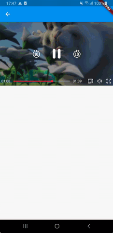
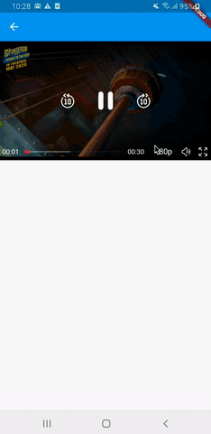
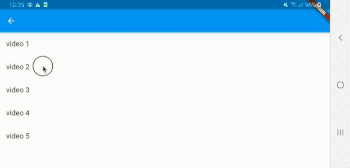
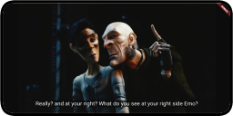

# flutter_meedu_media_kit


<a href="https://www.buymeacoffee.com/zezo357" target="_blank"></a>
<a href='https://ko-fi.com/zezo357' target='_blank'>

<a target="blank" href="https://pub.dev/packages/flutter_meedu_media_kit"></a>




<br/>




<br/>
<br/>


<table>
  <thead>
    <tr>
      <th>Feature</th>
      <th>iOS</th>
      <th>Android</th>
      <th>Windows</th>
      <th>Linux</th>
      <th>macOS</th>
      <th>Web</th>
    </tr>
  </thead>
  <tbody>
    <tr>
      <td>Videos from Network</td>
      <td>✔️</td>
      <td>✔️</td>
      <td>✔️</td>
      <td>✔️</td>
      <td>✔️</td>
      <td>✔️</td>
    </tr>
    <tr>
      <td>Videos from Assets</td>
      <td>✔️</td>
      <td>✔️</td>
      <td>✔️</td>
      <td>✔️</td>
      <td>✔️</td>
      <td>✔️</td>
    </tr>
    <tr>
      <td>Videos from Local Files</td>
      <td>✔️</td>
      <td>✔️</td>
      <td>✔️</td>
      <td>✔️</td>
      <td>✔️</td>
      <td>✔️</td>
    </tr>
    <tr>
      <td>Looping</td>
      <td>✔️</td>
      <td>✔️</td>
      <td>✔️</td>
      <td>✔️</td>
      <td>✔️</td>
      <td>✔️</td>
    </tr>
    <tr>
      <td>AutoPlay</td>
      <td>✔️</td>
      <td>✔️</td>
      <td>✔️</td>
      <td>✔️</td>
      <td>✔️</td>
      <td>✔️</td>
    </tr>
    <tr>
      <td>Swipe to Control Volume</td>
      <td>✔️</td>
      <td>✔️</td>
      <td>Keyboard Arrows</td>
      <td>Keyboard Arrows</td>
      <td>Keyboard Arrows</td>
      <td>Keyboard Arrows</td>
    </tr>
    <tr>
      <td>Swipe to Seek</td>
      <td>✔️</td>
      <td>✔️</td>
      <td>Keyboard Arrows</td>
      <td>Keyboard Arrows</td>
      <td>Keyboard Arrows</td>
      <td>Keyboard Arrows</td>
    </tr>
    <tr>
      <td>FullScreen</td>
      <td>✔️</td>
      <td>✔️</td>
      <td>✔️</td>
      <td>✔️</td>
      <td>✔️</td>
      <td>✔️</td>
    </tr>
    <tr>
      <td>Launch Player in FullScreen</td>
      <td>✔️</td>
      <td>✔️</td>
      <td>✔️</td>
      <td>✔️</td>
      <td>✔️</td>
      <td>✔️</td>
    </tr>
    <tr>
      <td>Playback Speed</td>
      <td>✔️</td>
      <td>✔️</td>
      <td>✔️</td>
      <td>✔️</td>
      <td>✔️</td>
      <td>✔️</td>
    </tr>
    <tr>
      <td>Fast Forward/Rewind</td>
      <td>✔️</td>
      <td>✔️</td>
      <td>✔️</td>
      <td>✔️</td>
      <td>✔️</td>
      <td>✔️</td>
    </tr>
    <!-- <tr>
      <td>SRT Subtitles</td>
      <td>✔️</td>
      <td>✔️</td>
      <td>✔️</td>
      <td>✔️</td>
      <td>✔️</td>
      <td>✔️</td>
    </tr> -->
    <tr>
      <td>Customization</td>
      <td>Partially</td>
      <td>Partially</td>
      <td>Partially</td>
      <td>Partially</td>
      <td>Partially</td>
      <td>Partially</td>
    </tr>
    <tr>
      <td>Picture in Picture (PIP)</td>
      <td>Not Implemented (Help Wanted)</td>
      <td>✔️</td>
      <td>✔️</td>
      <td>Implemented (Not tested)</td>
      <td>Implemented (Crashes, waiting for window_manager release, fixed in GitHub)</td>
      <td>Not Implemented</td>
    </tr>
  </tbody>
</table>


<!-- 👋 👉 <b>[Complete documentation here](https://zezo357.github.io/flutter_meedu_media_kit/)</b> -->

<!-- <table>
<caption><h4><a href="https://zezo357.github.io/flutter_meedu_media_kit_example/">Flutter Web Demo</a></h4></caption>

  <tbody>
    <tr>
      <td rowspan="2"></td>     
      <td></td>      
    </tr>   
    <tr>
      <td></td>     
    </tr>  
  </tbody>
</table> -->


# Video Player Controls


## Mobile Controls

- Swipe horizontally to seek forward or backward in the video. (<em>seekSwipes</em>)
- Swipe vertically on the right side of the screen to control the video volume. (<em>volumeSwipes</em>)
- Swipe vertically on the left side of the screen to control the video brightness. (<em>brightnessSwipes</em>)
- Double-tap on the sides of the screen to seek forward or backward in the video. (<em>doubleTapToSeek</em>)
- Long press on the screen to speed up the video, and the video slows down when the long press is released. (<em>onLongPressSpeedUp</em>)

## Desktop Controls

- One-click with the mouse to toggle play and pause. (<em>desktopTapToPlayAndPause</em>)
- Double-click with the mouse to toggle full-screen mode. (<em>desktopDoubleTapToFullScreen</em>)
- Use the keyboard up and down arrows to increase or decrease the video volume. (<em>volumeArrows</em>)
- Use the keyboard right and left arrows to seek forward or backward in the video. (<em>seekArrows</em>)
- Press the Escape key to close full-screen mode. (<em>escapeKeyCloseFullScreen</em>)
- Press the NumPad Decimal key (.) to toggle the video fit. (<em>numPadDecimalKeyToggleFit</em>)
- Press the Enter key to open full-screen mode. (<em>enterKeyOpensFullScreen</em>)
- Press the Space key to toggle between playing and pausing the video. (<em>spaceKeyTogglePlay</em>)


# Setup [media_kit](https://pub.dev/packages/media_kit).


---

# How to use

Fisrt you need to import the `meedu_player` plugin and create an instance of `MeeduPlayerController`

```dart
import 'package:meedu_player/meedu_player.dart';
.
.
.
final _meeduPlayerController = MeeduPlayerController();
```

> When you create an instance of `MeeduPlayerController` you can pass params like `controlsStyle, colorTheme, placeholder, etc`.

Now you can use the `MeeduVideoPlayer` widget to show your video, the `MeeduVideoPlayer` widget takes the size of its parent container (we recomend to use an AspectRatio widget)

```dart
 AspectRatio(
    aspectRatio: 16 / 9,
    child: MeeduVideoPlayer(
        controller: _meeduPlayerController,
    ),
),
```

In this moment you only can watch a **black** `Container` that is because you need to set a `DataSource` and pass it to your `MeeduPlayerController` instance.

<br/>

To play a video from **network**
```dart
 _meeduPlayerController.setDataSource(
      DataSource(
        type: DataSourceType.network,
        source: "https://www.radiantmediaplayer.com/media/big-buck-bunny-360p.mp4",
      ),
      autoplay: true,
);
```

<br/>

To play a video from **assets** (Make sure that your asset is defined in your `pubspec.yaml`)
```dart
 _meeduPlayerController.setDataSource(
      DataSource(
        type: DataSourceType.asset,
        source: "assets/video/big-buck-bunny-360p.mp4",
      ),
      autoplay: true,
);
```

<br/>

To play a video from a local **File**

```dart
 _meeduPlayerController.setDataSource(
      DataSource(
        type: DataSourceType.file,
        file: <YOUR INSTANCE OF FILE>,
      ),
      autoplay: true,
);
```

> **IMPORTANT:** When you don't need more the player you need to call to `dispose` to release the player

```dart
 _meeduPlayerController.dispose();
```

---

# Basic example

> We are using [wakelock](https://pub.dev/packages/wakelock) to keep the screen on when the video player is using

```dart
import 'package:flutter/material.dart';
import 'package:meedu_player/meedu_player.dart';
import 'package:wakelock/wakelock.dart';

class BasicExamplePage extends StatefulWidget {
  BasicExamplePage({Key? key}) : super(key: key);

  @override
  _BasicExamplePageState createState() => _BasicExamplePageState();
}

class _BasicExamplePageState extends State<BasicExamplePage> {
  final _meeduPlayerController = MeeduPlayerController(
    controlsStyle: ControlsStyle.primary,
  );

  @override
  void initState() {
    super.initState();
// The following line will enable the Android and iOS wakelock.
    Wakelock.enable();

    // Wait until the fisrt render the avoid posible errors when use an context while the view is rendering
    WidgetsBinding.instance!.addPostFrameCallback((_) {
      _init();
    });
  }

  @override
  void dispose() {
    // The next line disables the wakelock again.
    Wakelock.disable();
    _meeduPlayerController.dispose();// release the video player
    super.dispose();
  }

    /// play a video from network
  _init() {
    _meeduPlayerController.setDataSource(
      DataSource(
        type: DataSourceType.network,
        source: "https://www.radiantmediaplayer.com/media/big-buck-bunny-360p.mp4",
      ),
      autoplay: true,
    );
  }

  @override
  Widget build(BuildContext context) {
    return Scaffold(
      appBar: AppBar(),
      body: SafeArea(
        child: AspectRatio(
          aspectRatio: 16 / 9,
          child: MeeduVideoPlayer(
            controller: _meeduPlayerController,
          ),
        ),
      ),
    );
  }
}
```
