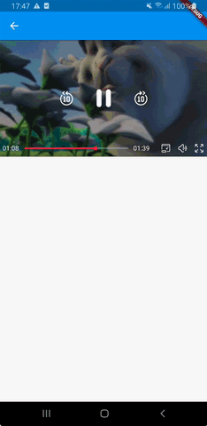

# Picture in Picture



> Only **Android** is supported for now, pip mode on iOS is supported since iOS 14 but the flutter SDK actually does not have a stable support for iOS 14

## Android

To enable the picture in picture mode on Android you need the next requirements.

First to allow to **meedu_player** listen the picture in picture events your `MainActivity` class must extends from `MeeduPlayerFlutterActivity`

```java
import com.zezo357.flutter_meedu_media_kit.MeeduPlayerFlutterActivity;

public class MainActivity extends MeeduPlayerFlutterActivity {
...
}
```

> The `MeeduPlayerFlutterActivity` class extends from `FlutterActivity` and overrides the `onPictureInPictureModeChanged` method to listen the changes in the pip mode.

In your `AndroidManifest.xml` in your MainActivity tag you must enable `android:supportsPictureInPicture` and `android:resizeableActivity`

```xml
    <activity android:name=".MainActivity"
        android:resizeableActivity="true"
        android:supportsPictureInPicture="true"
        android:configChanges="screenSize|smallestScreenSize|screenLayout|orientation"
        ...
```

> **NOTE:** The picture in picture mode is only available since **Android 7**

> When you create your instance of `MeeduPlayerController` you need pass the `pipEnabled` param as **true** and if you want to show the **pip button** in the controls and then you don't need call to `enterPip` method.

```dart
final _meeduPlayerController = MeeduPlayerController(
    controlsStyle: ControlsStyle.primary,
    pipEnabled: true, // use false to hide pip button in the player
    enabledButtons: EnabledButtons(pip: true), // pip is true by default, but only visible if pipEnabled is `true`
  );
```

To enter to the picture in picture mode you can call the `enterPip` method

```dart
_meeduPlayerController.enterPip(context);
```
